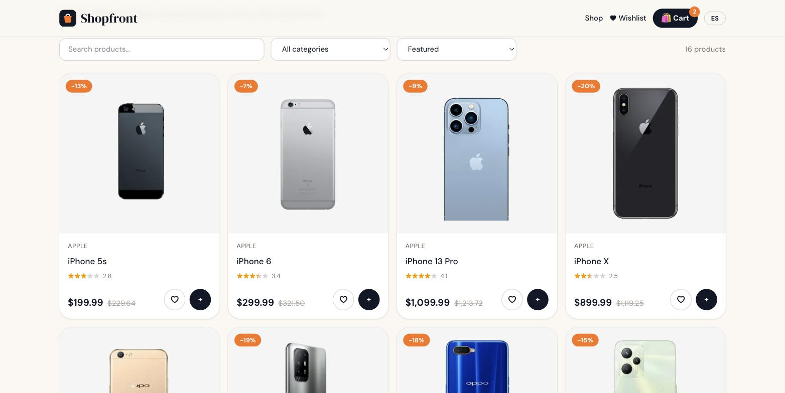

# Shopfront

[](https://github.com/MigueIAngel/shopfront/actions/workflows/ci.yml)


An e-commerce storefront built with **React 19** and **TypeScript**. It has a product catalog with filters, a persistent cart and wishlist, and a validated checkout flow. The UI is available in English and Spanish. Product data comes from the public [DummyJSON](https://dummyjson.com/docs/products) API.



## Features

- **Catalog**: 190+ products with debounced search, a category filter, sorting, pagination and skeleton loaders
- **Filters in the URL** (`?q=&category=&sort=&page=`), so they can be shared and survive reloads
- **Server state** with TanStack Query: caching, request cancellation (`AbortSignal`) and `keepPreviousData` for smooth pagination
- **Product page** with an image gallery, discounts, stock status and ratings
- **Cart** (Zustand + `persist`): merges repeated items, caps quantities at the available stock, and has a slide-over drawer
- **Pricing rules** in a pure, tested function: 8% tax, and free shipping over $100 with a "you're $X away" hint
- **Wishlist**, also persisted
- **Checkout** with react-hook-form + zod: address validation plus demo payment fields (Luhn checksum, future `MM/YY` expiry, CVC). Error messages are translated
- **i18n (EN/ES)**: language detection and locale-aware currency (`$12.99` / `12,99 US$`)
- Accessible dialogs (Esc to close, `aria-*`) and a responsive layout

## Tech stack

| Area | Tools |
|---|---|
| UI | React 19, TypeScript, Tailwind CSS 4, React Router 7 |
| State | Zustand (client state), TanStack Query (server state) |
| Forms | react-hook-form, zod 4 |
| i18n | i18next, react-i18next |
| Testing | Vitest, Testing Library (14 tests) |
| Tooling | Vite 8, oxlint, GitHub Actions, Vercel config |

## Getting started

```bash
npm install
npm run dev        # http://localhost:5173
```

```bash
npm test           # unit + component tests
npm run build      # production build in dist/
```

At checkout, use the test card `4242 4242 4242 4242` with any future expiry date. No payment is processed.

## Project structure

```
src/
├── api/           # typed DummyJSON client
├── components/    # layout, product card, cart drawer, actions
├── i18n/          # en.json, es.json
├── lib/           # cart totals, checkout schema, formatting
├── pages/         # catalog, product, wishlist, checkout, order
└── store/         # Zustand cart and wishlist
```

## License

MIT
